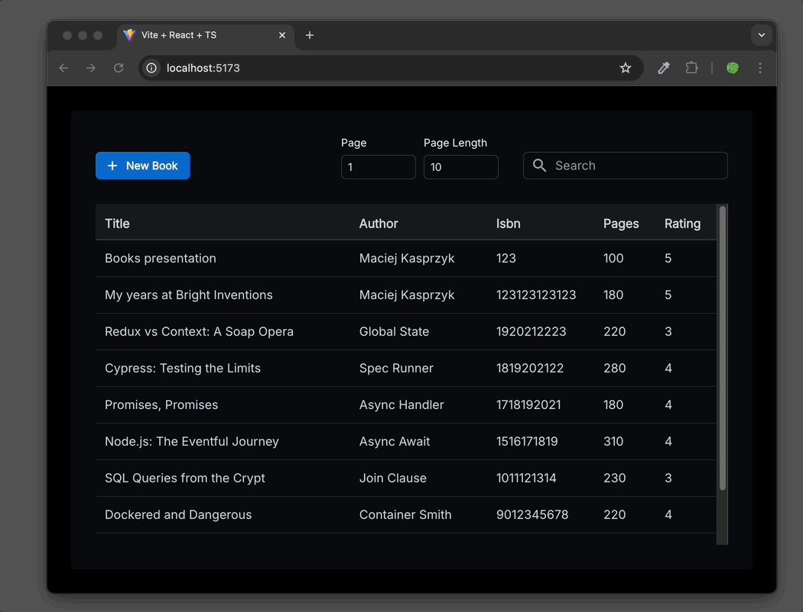

## Demo Book service

Bright Inventions Recruitment assignment



### How to run locally

Get the code and dependencies

```bash
git clone git@github.com:maciej-ka/demo-books.git
cd demo-books
npm i
```

In three separate terminals start three services

#### database

```bash
docker compose up
```

#### api

```bash
npm run start:dev -w api
```

#### web

```bash
npm run dev -w web
```

and visit http://localhost:5173

### TODO

- [x] init npm workspaces
- [x] start Postgres in Docker
- [x] init Nest.js
- [x] connect to database
- [x] create books module and entity
- [x] inspect db in psql
- [x] test with postman
- [x] seed database on start when empty
- [x] init Vite, TS and React
- [x] query books from api
- [x] setup joy, font, default dark mode, css reset
- [x] show books in table
- [x] setup router, button to empty create page
- [x] form layout
- [x] install formik and yup
- [x] add form client validation
- [x] mitigate number-string mismatch between Joy Select and CreateDto
- [x] insert in database on button click
- [x] sort table from most recent
- [x] remove unused endpoints from api
- [x] layout for search, page number, and page length
- [x] paging on api and connect it to web
- [x] add cancel link on form
- [x] ui changes: larger font in table, change button labels, create button icon
- [x] search on api and connect it to web
- [x] add db index on search columns
- [x] debounce search
- [x] add small demo animation to README

do if time left (in order of importance)

- [ ] validate create book data in api
- [ ] make a typical paging
  - [ ] return total count from findAll for paging
  - [ ] replace page input with typical paging component
  - [ ] replace page length input with few predefined options
  - [ ] ask users/client should we remember paging and limit in local store
- [ ] setup Playwright
- [ ] e2e test book create and view new on list
- [ ] extract PageLayout ui component to not repeat Sheet, border radius and standard padding
- [ ] setup CI/CD: eslint, prettier, tests, check that build is not failing

go to production

- [ ] turn off Nest.js db synchronize (perhaps make it node.process.env dependent)
- [ ] improve monorepo typescript config
- [ ] define production Dockerfile for api
- [ ] define pg-api deployment in docker compose or kubernetes
  - [ ] for performance deploy api on several containers behind load balancers in cluster
  - [ ] perhaps configure one database as leader with several readonly follower replicas
- [ ] deploy on merge to production branch
- [ ] decide on where to deploy web (something like s3 + cdn?)
